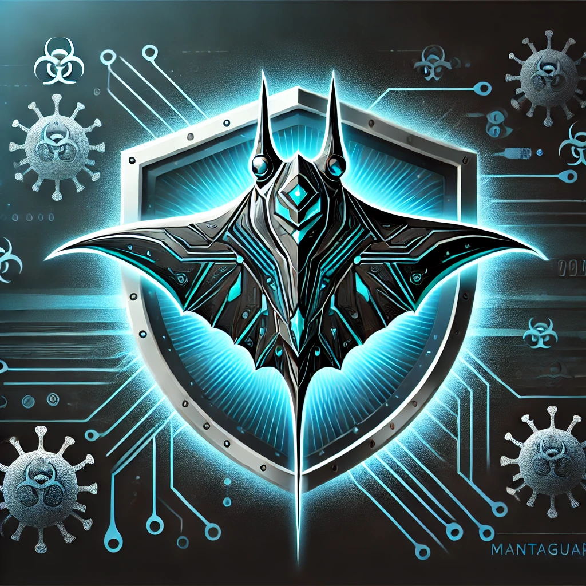

# 🛡️ MantaGuard
**AI-Powered Network Security Analysis & Anomaly Detection Platform**  
*Comprehensive network monitoring with intelligent threat classification and automated remediation*



---

## 📋 Table of Contents

### Part 1: Introduction
- [About MantaGuard](#-about-mantaguard)
- [Current Stable Features](#-current-stable-features)
- [System Architecture](#-system-architecture)

### Part 2: Setup & Quick Start
- [First Launch](#-first-launch)
- [Zeek Installation Guide](#-zeek-installation-guide)
- [Quick Start Guide](#-quick-start-guide)

### Part 3: User Guide (Stable Features)
- [Network Monitoring](#-network-monitoring)
- [PCAP Analysis](#-pcap-analysis)
- [Anomaly Detection (OCSVM)](#-anomaly-detection-ocsvm)
- [Reports & Visualization](#-reports--visualization)

### Part 4: Development Features (⚠️ Not Production Ready)
- [Features Under Development](#️-features-under-development)
- [ML Training Center](#ml-training-center-development)
- [Attack Classification](#attack-classification-development)
- [Advanced Model Management](#advanced-model-management-development)
- [API Integration](#api-integration-development)

### Additional Information
- [Troubleshooting](#-troubleshooting)
- [Contributing](#-contributing)

---

## 🔍 About MantaGuard

MantaGuard is a network security platform that combines **real-time packet capture**, **AI-powered anomaly detection using OneClassSVM**, and **comprehensive network analysis** to provide network visibility and threat detection capabilities.

### What Makes MantaGuard Special?

- **Real-time Anomaly Detection**: Advanced OneClassSVM model for identifying suspicious network behavior
- **Professional Web Interface**: Modern, responsive dashboard with real-time monitoring capabilities
- **Zeek Integration**: Deep packet inspection and comprehensive network protocol analysis
- **Easy Setup**: Simple initialization scripts for quick deployment and testing
- **Forensic Analysis**: Detailed connection analysis and exportable reports for investigation

---

## 🚀 Current Stable Features

### 🔍 **Network Monitoring** ✅
- **Live Packet Capture**: Real-time network traffic monitoring with interface selection
- **PCAP Analysis**: Upload and analyze existing packet capture files (.pcap, .pcapng)
- **Zeek Integration**: Leverage Zeek (formerly Bro) for deep packet inspection and log parsing
- **Multi-Protocol Support**: TCP, UDP, ICMP, and other network protocols

### 🤖 **Anomaly Detection (OCSVM)** ✅
- **OneClassSVM**: Machine learning model that identifies unusual network behavior patterns
- **Advanced Model Management**: Switch between different trained OCSVM models
- **Model Retraining**: Retrain models with manually labeled data
- **Anomaly Scoring**: Numerical scores indicating how anomalous each connection is
- **Real-time Analysis**: Live detection of suspicious network activity
- **Batch Processing**: Analysis of historical PCAP files for forensic investigation
- **Manual Labeling**: Interactive labeling of connections for improved training

### 📊 **Reports & Visualization** ✅
- **Enhanced Connection Analysis**: Detailed view of network connections with improved anomaly score visualization
- **Interactive Dashboard**: Modernized web-based interface with real-time monitoring capabilities
- **Advanced Data Export**: Export analysis results in multiple formats for further investigation
- **Historical Analysis**: Review past network activity with enhanced filtering and search
- **Anomaly Trend Analysis**: Visualize anomaly patterns over time with interactive charts
- **Connection Labeling Interface**: Direct labeling capabilities from the reports view

### 🔧 **Core Infrastructure** ✅
- **Web Interface**: Modern, responsive dashboard built with Flask and Bootstrap
- **Data Storage**: SQLite-based storage for connection data and analysis results
- **Configuration Management**: Flexible configuration system for customization
- **Logging & Debugging**: Comprehensive logging for troubleshooting and monitoring

---

## 🏗️ System Architecture

```
┌─────────────────┐    ┌─────────────────┐    ┌─────────────────┐
│   Web Interface │────│  Flask Backend  │────│ AI Engine      │
│   (Bootstrap)   │    │  (Python)       │    │ (Scikit-learn) │
└─────────────────┘    └─────────────────┘    └─────────────────┘
         │                       │                       │
         │                       │                       │
┌─────────────────┐    ┌─────────────────┐    ┌─────────────────┐
│ Connection      │    │ Training        │    │ Zeek Parser     │
│ Browser         │────│ Repository      │────│ (Network Data)  │
│ (Labeling UI)   │    │ (SQLite)        │    │                 │
└─────────────────┘    └─────────────────┘    └─────────────────┘
         │                       │                       │
         │                       │                       │
┌─────────────────┐    ┌─────────────────┐    ┌─────────────────┐
│ Reports &       │    │ Model Storage   │    │ Packet Capture  │
│ Analytics       │────│ (Joblib)        │────│ (Live/PCAP)     │
│ (Visualizations)│    │                 │    │                 │
└─────────────────┘    └─────────────────┘    └─────────────────┘
```

---

## 🚀 First Launch

### Prerequisites

#### System Requirements
- **Linux Operating System** (Ubuntu 20.04+, Debian 12+, or compatible distribution)
  - ⚠️ **Important**: MantaGuard requires Linux due to Zeek dependency limitations
  - Windows and macOS are not supported
- **Python 3.8+** (Python 3.9+ recommended)
- **Administrative privileges** (required for network packet capture and Zeek installation)
- **4GB+ RAM** recommended for optimal performance

#### Core Dependencies
- **Zeek Network Security Monitor** (formerly Bro)
  - Core component for network packet analysis and log generation
  - Must be installed before running MantaGuard
  - See [Zeek Installation Guide](#zeek-installation-guide) below if not installed
- **uv** package manager ([installation guide](https://docs.astral.sh/uv/getting-started/installation/))
  - Used for Python dependency management and virtual environments

### Quick Setup (Recommended)
```bash
# 1. Clone the repository
git clone https://github.com/PYCOD1-Group2/MantaGuard.git
cd MantaGuard

# 2. Initialize the project (installs dependencies and sets up environment)
./init.sh

# 3. Launch MantaGuard (starts server and opens browser)
./start.sh
```

That's it! MantaGuard will automatically open in your browser at `http://127.0.0.1:5000`.

### Manual Setup (Alternative)
If you prefer manual setup or the scripts don't work on your system:

```bash
# 1. Create virtual environment
uv venv

# 2. Activate virtual environment
source .venv/bin/activate  # Linux/macOS
# OR
.venv\Scripts\activate     # Windows

# 3. Install dependencies
uv sync

# 4. Launch application
uv run python app.py
```

---

## 📦 Zeek Installation Guide

> **Note**: The `init.sh` script will automatically check for Zeek and offer to install it for you. This section is for manual installation or troubleshooting.

### Automatic Installation (Recommended)
The easiest way to install Zeek is to let MantaGuard handle it:
```bash
./init.sh  # Will detect missing Zeek and offer to install it
```

### Manual Installation

#### Ubuntu (20.04, 22.04, 24.04)

1. **Add Zeek Repository:**
```bash
# Add GPG key
curl -fsSL https://download.opensuse.org/repositories/security:zeek/xUbuntu_$(lsb_release -rs)/Release.key | gpg --dearmor | sudo tee /etc/apt/trusted.gpg.d/security_zeek.gpg > /dev/null

# Add repository
echo "deb http://download.opensuse.org/repositories/security:/zeek/xUbuntu_$(lsb_release -rs)/ /" | sudo tee /etc/apt/sources.list.d/security:zeek.list
```

2. **Install Zeek:**
```bash
sudo apt update
sudo apt install -y zeek
```

#### Debian 12

1. **Add Zeek Repository:**
```bash
# Add GPG key
curl -fsSL https://download.opensuse.org/repositories/security:zeek/Debian_12/Release.key | gpg --dearmor | sudo tee /etc/apt/trusted.gpg.d/security_zeek.gpg > /dev/null

# Add repository
echo 'deb http://download.opensuse.org/repositories/security:/zeek/Debian_12/ /' | sudo tee /etc/apt/sources.list.d/security:zeek.list
```

2. **Install Zeek:**
```bash
sudo apt update
sudo apt install -y zeek
```

### Verify Installation

After installation, verify Zeek is working:
```bash
# Check if Zeek is installed
zeek --version

# Check if zeekctl is available
zeekctl --help

# Test basic functionality
echo 'print "Hello from Zeek";' | zeek
```

### Troubleshooting

**Common Issues:**

1. **"zeek: command not found"**
   - Zeek may be installed in `/opt/zeek/bin/`
   - Add to PATH: `export PATH="/opt/zeek/bin:$PATH"`
   - Or create symlinks: `sudo ln -s /opt/zeek/bin/zeek /usr/local/bin/zeek`

2. **Permission errors during installation**
   - Ensure you have sudo privileges
   - Some distributions may require additional repositories

3. **Repository key issues**
   - Try updating ca-certificates: `sudo apt update && sudo apt install ca-certificates`
   - Manually verify GPG key import

**Additional Resources:**
- [Official Zeek Documentation](https://docs.zeek.org/en/stable/install/index.html)
- [Zeek Package Downloads](https://zeek.org/download/)

---

## ⚡ Quick Start Guide

### 1. **Access MantaGuard**
After running `./start.sh`, your browser should automatically open to `http://127.0.0.1:5000`.

If it doesn't open automatically, navigate there manually.

### 2. **Start Network Scanning**
1. Go to **Scanning** tab
2. Select your network interface
3. Click **Start Live Capture**
4. Monitor real-time traffic

### 3. **Review Detected Anomalies**
1. Navigate to **Reports** tab
2. View detected threats and anomalies
3. Click on any anomaly for detailed analysis

### 4. **Label Training Data & Retrain Models**
1. Go to **ML Training Center** tab
2. Use **Connection Browser** to filter connections by anomaly status
3. Select connections and apply manual labels (normal/anomalous)
4. **Retrain OCSVM models** with newly labeled data
5. **Switch between model versions** to compare performance

---

## 📖 User Guide - Stable Features

## 🔍 Network Monitoring

### Live Packet Capture
Monitor network traffic in real-time through the web interface:

1. **Access Scanning Tab**: Navigate to the "Scanning" section in the web interface
2. **Interface Selection**: Choose your network interface from the dropdown menu
3. **Start Monitoring**: Click "Start Live Capture" to begin packet capture
4. **Real-time Analysis**: Watch as connections are analyzed by the OCSVM model
5. **Stop Capture**: Click "Stop Capture" when finished

**Best Practices:**
- Use the primary network interface for comprehensive monitoring
- Start with shorter capture durations for initial testing
- Ensure you have administrative privileges for packet capture

### PCAP File Analysis
Analyze existing packet capture files:

1. **File Upload**: Navigate to the "Scanning" tab and use the file upload section
2. **Select Files**: Choose .pcap or .pcapng files from your system
3. **Processing**: Files are automatically parsed through Zeek for feature extraction
4. **Analysis**: The OCSVM model analyzes all connections for anomalies
5. **Results**: Review findings in the "Reports" section

**Supported Formats:**
- `.pcap` - Standard packet capture format
- `.pcapng` - Next generation packet capture format

---

## 🤖 Anomaly Detection (OCSVM)

### How the OCSVM Model Works

MantaGuard uses OneClassSVM for anomaly detection:

1. **Feature Extraction**: Network connections are converted to feature vectors
2. **Anomaly Detection**: OCSVM identifies connections that deviate from normal patterns
3. **Scoring**: Each connection receives an anomaly score
4. **Classification**: Connections are flagged as normal or anomalous

### Advanced Model Management

**Model Switching Capabilities:**
- **Multiple OCSVM Models**: Switch between different trained models
- **Model Versions**: Access different versions of trained models
- **Real-time Switching**: Change active models without system restart
- **Model Comparison**: Compare performance across different model versions

**Model Retraining:**
- **Manual Data Labeling**: Label connections directly from the interface
- **Incremental Training**: Retrain models with new labeled data
- **Training Data Management**: Organize and manage training datasets
- **Performance Validation**: Track model accuracy improvements

### Understanding Anomaly Scores

**Score Interpretation:**
- **< -0.5**: Highly anomalous (likely suspicious activity)
- **-0.5 to 0**: Moderately suspicious (requires investigation)
- **> 0**: Normal behavior (typical network activity)

**What the Model Detects:**
- Unusual connection patterns
- Abnormal data transfer volumes
- Suspicious timing patterns
- Atypical protocol usage

---

## 📊 Reports & Visualization

### Enhanced Security Dashboard

Access comprehensive analysis results through the improved Reports section:

**Overview Information:**
- Total connections analyzed with real-time updates
- Number of anomalies detected with severity breakdown
- Analysis timestamp and duration tracking
- Source information (live capture or PCAP file)
- Model information and version details

**Advanced Connection Details:**
- Source and destination IP addresses and ports
- Protocol information with enhanced categorization
- Connection duration and data transfer metrics
- Anomaly score with confidence indicators
- **Manual labeling capabilities** for training data generation
- Connection trend analysis and historical comparison

**Interactive Features:**
- **Real-time anomaly filtering** and search capabilities
- **Direct connection labeling** from the reports interface
- **Anomaly score visualization** with interactive charts
- **Time-based analysis** with customizable date ranges

### Enhanced Data Export

**Export Options:**
- View detailed connection information with enhanced formatting
- Export analysis results in multiple formats (CSV, JSON)
- Save reports for compliance or documentation with timestamps
- Generate comprehensive forensic analysis summaries
- **Export labeled training data** for model development

---

## 🔧 System Operations

### Configuration

**Data Storage:**
- SQLite database for connection data
- Analysis results stored locally
- Configurable data retention policies

**Performance:**
- Real-time processing capabilities
- Batch analysis for large PCAP files
- Scalable to handle various network sizes

### Monitoring

**Application Health:**
- Web interface status monitoring
- Analysis processing status
- Database connectivity verification
- Resource usage tracking

---

## ⚠️ Features Under Development

> **🚨 IMPORTANT DISCLAIMER**
> 
> The features described in this section are **UNDER ACTIVE DEVELOPMENT** and are **NOT PRODUCTION READY**. These features may be unstable, incomplete, or non-functional. Use at your own risk and only for testing/development purposes.
> 
> **Current Status:** Development/Experimental
> **Recommended Use:** Testing and development only
> **Production Use:** NOT RECOMMENDED

### ML Training Center (Development)

**Status:** 🟡 Actively Developed - Core Features Working

The ML Training Center provides enhanced capabilities for model management and training:

**✅ Working Features:**
- **Manual Anomaly Labeling**: Interactive interface for labeling network connections as normal or anomalous
- **OCSVM Model Retraining**: Retrain OneClassSVM models with newly labeled data
- **Model Switching**: Switch between different OCSVM model versions
- **Training Data Management**: View and manage labeled training datasets
- **Model Performance Tracking**: Monitor model accuracy and performance metrics

**🔧 In Development:**
- Advanced model comparison tools
- Batch labeling operations
- Automated model validation workflows

**Access:** Available in the web interface with functional core features

### Attack Classification (Development)

**Status:** 🔴 Under Development

The attack classification system is designed to:
- Categorize specific types of network attacks
- Provide detailed threat intelligence
- Support multi-class classification models

**Current Issues:**
- Classification models are not fully trained
- Categories may be inaccurate or incomplete
- Feature is not integrated with main analysis pipeline

**Note:** Currently only OCSVM anomaly detection is stable and functional

### Advanced Model Management (Development)

**Status:** 🟡 Actively Developed - OCSVM Management Working

Advanced model management features now include:

**✅ Working Features:**
- **OCSVM Model Switching**: Switch between different trained OCSVM models
- **Model Versioning**: Track and manage multiple model versions
- **Model Performance Metrics**: View training accuracy and validation results
- **Custom OCSVM Training**: Train new OneClassSVM models with custom parameters
- **Model Persistence**: Save and load trained models reliably

**🔧 In Development:**
- Hybrid model combinations (OCSVM + Multi-class)
- Advanced model comparison dashboards
- Automated model selection based on performance
- Cross-validation and testing frameworks

**Current Limitation:** Multi-class classification models are still under development

### API Integration (Development)

**Status:** 🔴 Under Development

API endpoints are planned for:
- Programmatic access to analysis results
- Remote training and model management
- Integration with external security tools

**Current Issues:**
- API endpoints may be non-functional
- Authentication and security not implemented
- Documentation is incomplete

**Recommendation:** Use the web interface for all interactions

### Automated Remediation (Development)

**Status:** 🔴 Under Development

Planned remediation features include:
- Automated port blocking
- IP blacklisting
- Vulnerability patching

**Current Issues:**
- Remediation actions are not implemented
- Safety mechanisms are not in place
- May cause system instability

**WARNING:** Do not attempt to use remediation features as they may affect system security

---

## 💻 Installation & Setup

### Prerequisites

**System Requirements:**
- Python 3.8 or higher
- 4GB+ RAM recommended
- Network interface access
- Administrative privileges (for packet capture)

**Required Dependencies:**
```bash
pip install -r requirements.txt
```

### Installation Steps

1. **Clone Repository:**
```bash
git clone https://github.com/PYCOD1-Group2/MantaGuard.git
cd MantaGuard
```

2. **Install Dependencies:**
```bash
uv venv
source .venv/bin/activate  # On Windows: .venv\Scripts\activate
uv pip install -r requirements.txt
```

3. **Initialize System:**
```bash
python -c "from mantaguard.utils.config import initialize_system; initialize_system()"
```

4. **Start Application:**
```bash
python app.py
```

### Configuration

**Environment Variables:**
- `MANTAGUARD_DEBUG`: Enable debug mode
- `MANTAGUARD_PORT`: Custom port (default: 5000)
- `MANTAGUARD_MODEL_DIR`: Custom model directory

**Configuration Files:**
- `config/settings.yaml`: Main configuration
- `data/unknown_categories.json`: Custom category definitions

---

## 🔧 Troubleshooting

### Common Issues

**"No Network Interfaces Found"**
- Ensure administrative privileges
- Check network interface availability
- Verify driver compatibility

**"Model Loading Failed"**
- Check model file integrity
- Verify Python dependencies
- Review error logs in console

**"PCAP Upload Failed"**
- Confirm file format compatibility
- Check file size limits
- Ensure sufficient disk space

**"Training Data Insufficient"**
- Label more connections manually
- Import additional training data
- Balance category representation

### Performance Optimization

**Large Network Environments:**
- Increase capture buffer sizes
- Use sampling for high-traffic networks
- Deploy distributed scanning

**Memory Management:**
- Monitor feature vector sizes
- Implement data pagination
- Regular model cleanup

### Getting Help

**Debug Information:**
1. Check browser console for JavaScript errors
2. Review Flask application logs
3. Examine model training outputs
4. Verify database integrity

**Community Support:**
- GitHub Issues for bug reports
- Discussions for feature requests
- Wiki for extended documentation

---

## 🤝 Contributing

We welcome contributions to MantaGuard! Here's how to get involved:

### Development Setup

1. **Fork and Clone:**
```bash
git clone https://github.com/PYCOD1-Group2/MantaGuard.git
cd MantaGuard
```

2. **Development Environment:**
```bash
uv venv
source .venv/bin/activate
uv pip install -r requirements.txt
uv pip install -r requirements-dev.txt
```

3. **Run Tests:**
```bash
pytest tests/
```

### Contribution Guidelines

**Code Standards:**
- Follow PEP 8 style guidelines
- Include comprehensive docstrings
- Add unit tests for new features
- Update documentation as needed

**Feature Development:**
- Create feature branches from `main`
- Submit pull requests with detailed descriptions
- Include test cases and documentation
- Ensure backward compatibility

**Bug Reports:**
- Use GitHub Issues template
- Include reproduction steps
- Provide system information
- Attach relevant logs

---

## 📄 License

This project is licensed under the MIT License - see the [LICENSE](LICENSE) file for details.

---

## 🙏 Acknowledgments

MantaGuard builds upon the incredible work of the open source community. We extend our gratitude to the following projects and communities:

### Core Dependencies
- **[Zeek Project](https://zeek.org/)**: Network security monitoring framework (formerly Bro) - the foundation of our network analysis capabilities
- **[Python](https://python.org/)**: Programming language and runtime environment
- **[Scikit-learn](https://scikit-learn.org/)**: Machine learning library providing the OneClassSVM implementation
- **[Flask](https://flask.palletsprojects.com/)**: Web application framework powering our user interface
- **[SQLite](https://sqlite.org/)**: Embedded database engine for data storage

### Development & Packaging Tools
- **[UV](https://docs.astral.sh/uv/)**: Fast Python package installer and resolver for dependency management
- **[Bootstrap](https://getbootstrap.com/)**: CSS framework for responsive web UI components
- **[jQuery](https://jquery.com/)**: JavaScript library for DOM manipulation and AJAX
- **[Chart.js](https://www.chartjs.org/)**: JavaScript charting library for data visualization

### Python Libraries
- **[NumPy](https://numpy.org/)**: Fundamental package for scientific computing
- **[Pandas](https://pandas.pydata.org/)**: Data analysis and manipulation library
- **[Joblib](https://joblib.readthedocs.io/)**: Library for model serialization and parallel computing
- **[Werkzeug](https://werkzeug.palletsprojects.com/)**: WSGI utility library used by Flask

### Security & Research Community
- **Security Research Community**: For threat intelligence, attack patterns, and security methodologies
- **Network Security Practitioners**: For real-world insights and validation of detection approaches
- **Open Source Contributors**: All developers who contribute to the tools and libraries we depend on

### Special Recognition
- **The Zeek Community**: For maintaining and evolving the most comprehensive network analysis platform
- **Scikit-learn Developers**: For providing accessible and robust machine learning implementations
- **Flask Development Team**: For creating an elegant and powerful web framework

---

**Open Source Philosophy**: MantaGuard is built with and for the open source community. We believe in transparency, collaboration, and giving back to the projects that make our work possible.

---

**MantaGuard** - *Protecting your network with intelligent analysis*

For questions, support, or feature requests, please visit our [GitHub repository](https://github.com/PYCOD1-Group2/MantaGuard).