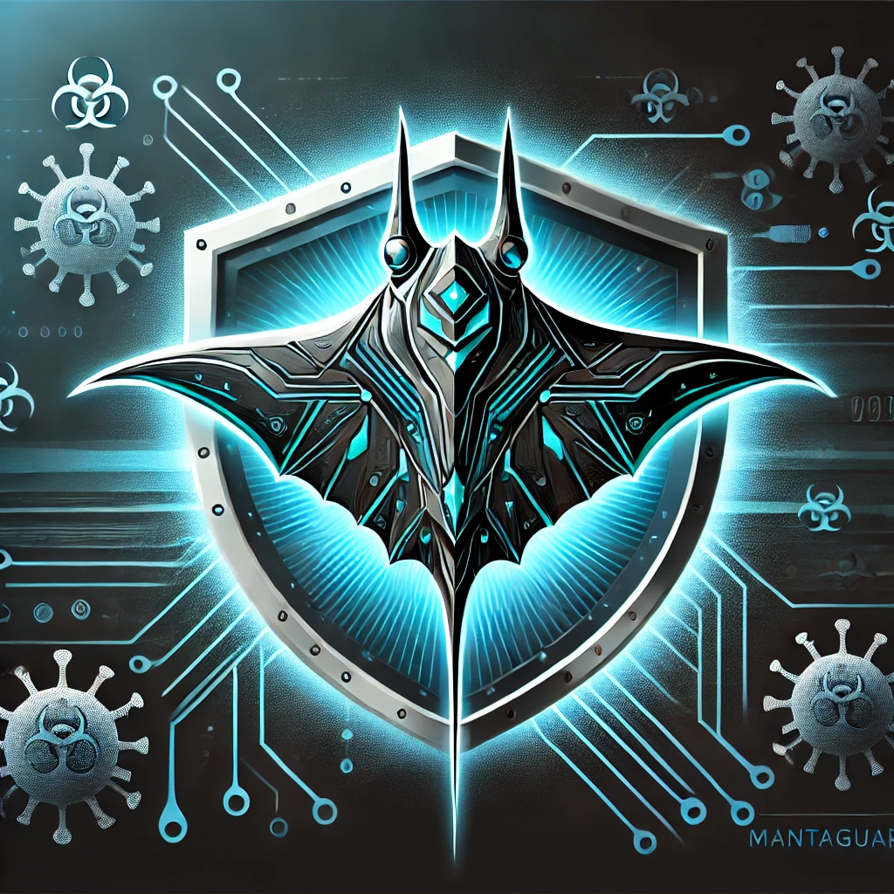

# 🛡️ MantaGuard
**AI-Powered Network Scanner**  
*Detect, analyze, and mitigate network threats effortlessly.*

 <!-- Replace with your image path -->

---

## 📋 Table of Contents
- [About the Project](#about-the-project)
- [Features](#features)
- [Technologies Used](#technologies-used)
- [Getting Started](#getting-started)
  - [Prerequisites](#prerequisites)
  - [Installation](#installation)
- [Usage](#usage)
- [Project Structure](#project-structure)
- [Contributing](#contributing)
- [License](#license)

---

## 🔍 About the Project
**MantaGuard** is an AI-powered network scanner designed to identify and mitigate suspicious activities on a network. Built using Python and leveraging the **WireShark** library, it provides a user-friendly interface and a comprehensive dashboard displaying the most common network attacks.  

Clicking on an attack reveals actionable solutions. Additionally, MantaGuard can patch certain vulnerabilities, close open ports, and ban suspicious IP addresses automatically.

---

## 🚀 Features
- **AI-Powered Analysis:** Detect suspicious activities using intelligent algorithms.
- **WireShark Integration:** Leverage the power of WireShark for packet analysis.
- **Interactive Dashboard:**  
  - Visualize common attacks.
  - Click-to-view solutions for threats.
- **Automated Security:**  
  - Patch open ports.
  - Ban suspicious IPs.
- **User-Friendly Interface:** Simplified controls and real-time monitoring.

---

## 🛠️ Technologies Used
- **Programming Language:** Python
- **Libraries:**  
  - WireShark Python Library
  - Tkinter or PyQt (for GUI)
  - Scikit-learn / TensorFlow (for AI algorithms)
- **Others:**  
  - SQLite (for logs and history)
  - Matplotlib / Plotly (for graphs and charts)

---

## 🏁 Getting Started

### Prerequisites
- **Python 3.8+** installed on your machine.
- **pip** package manager.

### Installation
1. **Clone the repository:**
   ```bash
   git clone https://github.com/your-username/MantaGuard.git
   cd MantaGuard
